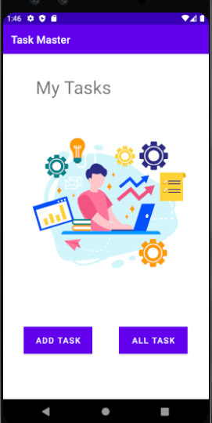
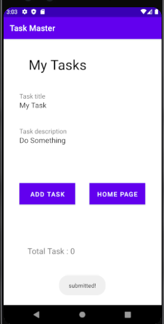
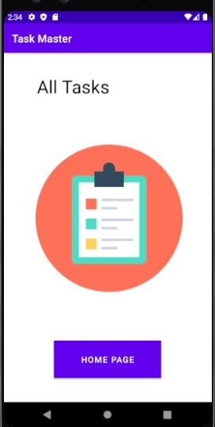
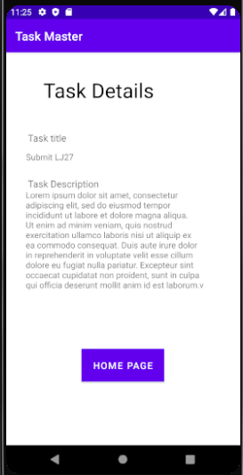
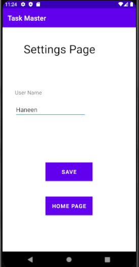
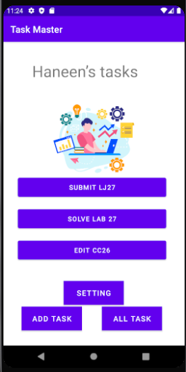
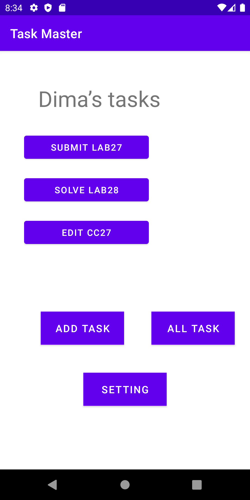
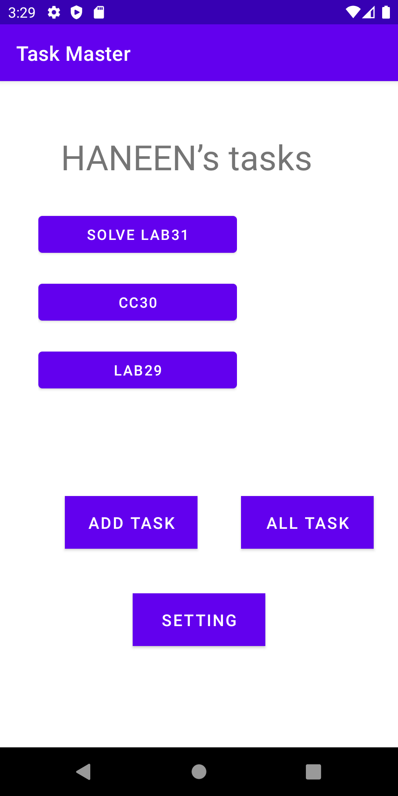
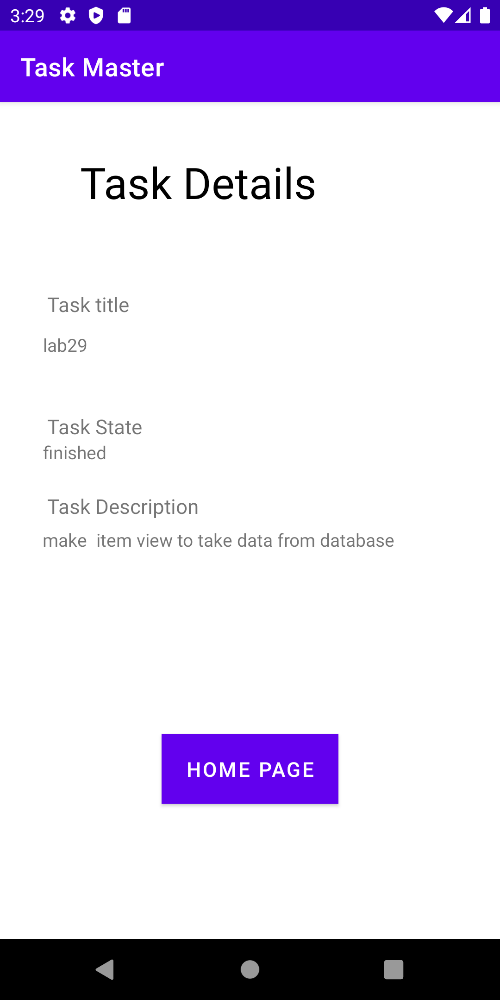

# Taskmaster

### Feature Tasks lab26

*Homepage*

This main page , it  have a heading at the top of the page, an image to mock the “my tasks” view, and buttons at the bottom of the page to allow going to the “add tasks” and “all tasks” page.

*Add a Task*

On the “Add a Task” page, allow users to type in details about a new task, specifically a title and a body. When users click the “submit” button, show a “submitted!” label on the page.

*All Tasks*

The all tasks page should just be an image with a back button; it needs no functionality.
\

### Feature Tasks lab27

*Task Detail Page*

 Task Detail page. It  have a title at the top of the page, and a Lorem Ipsum description.

*Settings Page*

 Settings page. It  allow users to enter their username and hit save.

 

*Homepage*

The main page  modified to contain three different buttons with hardcoded task titles. When a user taps one of the titles, it should go to the Task Detail page, and the title at the top of the page should match the task title that was tapped on the previous page.

The homepage should also contain a button to visit the Settings page, and once the user has entered their username, it should display “{username}’s tasks” above the three task buttons.

### Feature Tasks lab28

*Task Model*

Task class. A Task have a title, a body, and a state. The state should be one of “new”, “assigned”, “in progress”, or “complete”.

*Homepage*

Refactor  homepage now to use a RecyclerView for displaying Task data. This should have hardcoded Task data .

Ensure that you can tap on any one of the Tasks in the RecyclerView, and it will appropriately launch the detail page with the correct Task title displayed.

### Feature Tasks lab29

*Task Model and Room*

use room to save data in local , save data fron form add task to data base 

*Homepage*

 homepage’s RecyclerView to display all Task entities in your database.

*Detail Page*

Now the description and status of a tapped task are also displayed on the detail page, in addition to the title. the app set data from database

### Feature Tasks lab31

*Espresso Testing*

Add Espresso to  application, and use it to test basic functionality of the main components of  application. For example:

    assert that important UI elements are displayed on the page
    tap on a task, and assert that the resulting activity displays the name of that task
    edit the user’s username, and assert that it says the correct thing on the homepage
